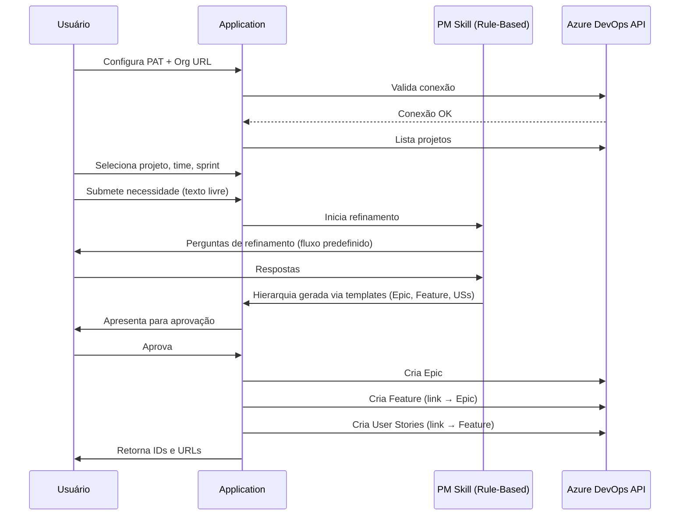
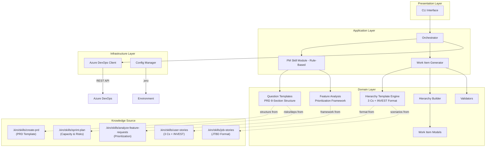
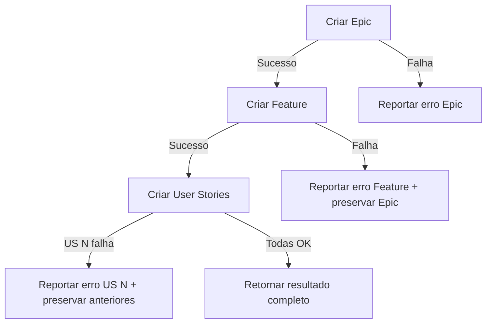

# Design Document: Azure DevOps Work Items Creator

## Overview

Esta aplicação é uma ferramenta CLI/interativa em TypeScript (Node.js) que automatiza a criação de work items no Azure DevOps seguindo uma hierarquia padronizada: Epic → Feature → N User Stories. A aplicação integra um módulo de PM Skill baseado em regras que conduz sessões de refinamento interativas usando frameworks de PM comprovados (PRD Template, 3 C's + INVEST, Feature Request Analysis) provenientes do repositório open-source [pm-skills](https://github.com/phuryn/pm-skills) (MIT license), copiados para `.kiro/skills/`. O módulo implementa esses frameworks como fluxos de perguntas guiados e templates de geração, sem dependência de LLM.

### Fonte de Conhecimento PM

Os frameworks utilizados pelo PM Skill Module são baseados nas seguintes skills em `.kiro/skills/`:

| Skill | Arquivo | Uso no Sistema |
|-------|---------|----------------|
| **create-prd** | `.kiro/skills/create-prd/SKILL.md` | Estrutura as perguntas de refinamento seguindo o template PRD de 8 seções (Background, Objective, Market Segments, Value Propositions, Solution, Release) |
| **user-stories** | `.kiro/skills/user-stories/SKILL.md` | Define o formato de geração das User Stories usando 3 C's (Card, Conversation, Confirmation) + critérios INVEST |
| **analyze-feature-requests** | `.kiro/skills/analyze-feature-requests/SKILL.md` | Fornece o framework de priorização e estruturação do Epic/Feature (tema, alinhamento estratégico, impacto, esforço, risco) |
| **job-stories** | `.kiro/skills/job-stories/SKILL.md` | Formato alternativo "When [situation], I want to [motivation], so I can [outcome]" para cenários de uso |
| **sprint-plan** | `.kiro/skills/sprint-plan/SKILL.md` | Referência para estimativa de capacidade e dependências (usado na seção de riscos/dependências) |

### Decisões Técnicas

| Decisão | Escolha | Justificativa |
|---------|---------|---------------|
| Linguagem | TypeScript | Tipagem forte, ecossistema Node.js maduro, SDK oficial disponível |
| SDK Azure DevOps | `azure-devops-node-api` | SDK oficial da Microsoft para Node.js |
| PM Skill | Módulo rule-based baseado em PM frameworks | Frameworks comprovados (PRD, 3 C's, INVEST) implementados como fluxos de perguntas, sem dependência de LLM |
| Fonte de frameworks | `.kiro/skills/` (pm-skills, MIT) | Frameworks open-source validados pela comunidade PM |
| Interface | CLI interativa | Simplicidade, portabilidade, fácil integração futura |
| Armazenamento de config | Variáveis de ambiente + `.env` | Segurança para PAT, padrão da indústria |

### Fluxo Principal



## Architecture

A aplicação segue uma arquitetura em camadas com separação clara de responsabilidades. Os frameworks PM (`.kiro/skills/`) servem como fonte de conhecimento para o Domain Layer:



### Camadas

1. **Presentation Layer**: Interface CLI interativa usando `inquirer` para prompts e seleções
2. **Application Layer**: Orquestração do fluxo, PM Skill (rule-based) para refinamento, geração de work items
3. **Domain Layer**: Modelos de domínio, construção de hierarquia, validações, templates de perguntas (baseados nos frameworks PM), engine de geração (3 C's + INVEST)
4. **Knowledge Source**: Frameworks PM open-source em `.kiro/skills/` que definem a ESTRUTURA e os FORMATOS — o código os implementa como fluxos de perguntas guiados e templates de geração
5. **Infrastructure Layer**: Cliente HTTP para Azure DevOps, gerenciamento de configuração

## Components and Interfaces

### 1. ConfigManager

Responsável por carregar e validar configurações da aplicação.

```typescript
interface AppConfig {
  organizationUrl: string;  // https://dev.azure.com/{org}
  pat: string;              // Personal Access Token
}

interface ConfigManager {
  loadConfig(): Promise<AppConfig>;
  validateConfig(config: AppConfig): ValidationResult;
}
```

### 2. AzureDevOpsClient

Encapsula todas as interações com a API do Azure DevOps.

```typescript
interface AzureDevOpsClient {
  validateConnection(): Promise<boolean>;
  listProjects(): Promise<Project[]>;
  listTeams(projectId: string): Promise<Team[]>;
  listSprints(projectId: string, teamId: string): Promise<Sprint[]>;
  createWorkItem(params: CreateWorkItemParams): Promise<WorkItemResult>;
}

interface CreateWorkItemParams {
  projectName: string;
  workItemType: 'Epic' | 'Feature' | 'User Story';
  title: string;
  description: string;
  areaPath: string;
  iterationPath: string;
  acceptanceCriteria?: string;
  parentId?: number;
}

interface WorkItemResult {
  id: number;
  url: string;
  type: string;
  title: string;
}
```

### 3. PMSkill (Rule-Based)

Módulo que conduz sessões de refinamento usando o framework PRD de 8 seções (`.kiro/skills/create-prd/`) como estrutura de conversa guiada, e o framework de análise de feature requests (`.kiro/skills/analyze-feature-requests/`) para priorização. Não depende de nenhuma API externa de LLM — os frameworks definem a estrutura, o código implementa como fluxo de perguntas.

```typescript
interface PMSkill {
  startRefinement(userNeed: string): RefinementSession;
  getNextQuestion(session: RefinementSession): Question | null;
  processAnswer(session: RefinementSession, answer: string): RefinementSession;
  isSessionComplete(session: RefinementSession): boolean;
  generateHierarchy(session: RefinementSession): WorkItemHierarchy;
  adjustHierarchy(hierarchy: WorkItemHierarchy, feedback: string): WorkItemHierarchy;
}

interface RefinementSession {
  id: string;
  userNeed: string;
  currentSectionIndex: number;      // Índice da seção PRD atual
  currentQuestionIndex: number;
  answers: Map<string, string>;
  status: 'in_progress' | 'completed';
  collectedInfo: CollectedInfo;
}

interface Question {
  id: string;
  text: string;
  section: PRDSection;              // Seção PRD à qual pertence
  required: boolean;
  followUp?: string;  // Pergunta de follow-up se resposta for insuficiente
}

// Seções baseadas no template PRD de 8 seções (create-prd skill)
type PRDSection =
  | 'background'           // Contexto: sobre o que é esta iniciativa? Por que agora?
  | 'objective'            // Objetivo, métricas de sucesso (OKR SMART)
  | 'market_segments'      // Para quem estamos construindo? Restrições?
  | 'value_propositions'   // Jobs/necessidades dos clientes, ganhos, dores evitadas
  | 'solution'             // Funcionalidades-chave, premissas, integrações
  | 'release'              // Escopo v1 vs futuro, dependências, riscos
  | 'user_scenarios'       // Cenários de uso (formato job-stories)
  | 'acceptance_criteria'; // Critérios de aceitação (formato 3 C's)
```

### 4. QuestionTemplates (PRD 8-Section Structure)

Define os fluxos de perguntas seguindo a estrutura do template PRD de 8 seções (`.kiro/skills/create-prd/SKILL.md`). Cada seção do PRD mapeia para um conjunto de perguntas que coletam as informações necessárias para gerar a hierarquia de work items.

```typescript
interface QuestionFlow {
  section: PRDSection;
  sectionTitle: string;           // Nome da seção PRD
  purpose: string;                // O que esta seção coleta
  mapsTo: 'epic' | 'feature' | 'user_stories' | 'metadata';  // Para qual work item contribui
  questions: QuestionTemplate[];
  minAnswersRequired: number;
}

interface QuestionTemplate {
  id: string;
  text: string;
  required: boolean;
  followUpCondition?: (answer: string) => boolean;  // Se true, faz follow-up
  followUpText?: string;
}

// Fluxos baseados no PRD Template de 8 seções (create-prd skill)
// + cenários de uso (job-stories skill) + critérios (user-stories skill)
const QUESTION_FLOWS: QuestionFlow[] = [
  {
    section: 'background',
    sectionTitle: '3. Background (PRD)',
    purpose: 'Coletar contexto e motivação — alimenta o Epic',
    mapsTo: 'epic',
    questions: [
      { id: 'bg_1', text: 'Sobre o que é esta iniciativa? Qual é o contexto?', required: true },
      { id: 'bg_2', text: 'Por que agora? Algo mudou recentemente que motiva esta demanda?', required: true },
      { id: 'bg_3', text: 'Isso é algo que só recentemente se tornou possível? (nova tecnologia, regulação, etc.)', required: false },
    ],
    minAnswersRequired: 2,
  },
  {
    section: 'objective',
    sectionTitle: '4. Objective (PRD)',
    purpose: 'Definir objetivo e métricas de sucesso — alimenta o Epic',
    mapsTo: 'epic',
    questions: [
      { id: 'obj_1', text: 'Qual é o objetivo principal? Por que isso importa para o negócio?', required: true },
      { id: 'obj_2', text: 'Como isso beneficia a empresa e os clientes?', required: true },
      { id: 'obj_3', text: 'Como você vai medir o sucesso? (métricas, KPIs, OKRs)', required: false },
      { id: 'obj_4', text: 'Como isso se alinha com a visão e estratégia do produto?', required: false },
    ],
    minAnswersRequired: 2,
  },
  {
    section: 'market_segments',
    sectionTitle: '5. Market Segments (PRD)',
    purpose: 'Identificar público-alvo e restrições — alimenta Epic/Feature',
    mapsTo: 'epic',
    questions: [
      { id: 'mkt_1', text: 'Para quem estamos construindo isso? Quem são os usuários/beneficiários?', required: true },
      { id: 'mkt_2', text: 'Existem restrições ou limitações conhecidas? (técnicas, regulatórias, de mercado)', required: false },
    ],
    minAnswersRequired: 1,
  },
  {
    section: 'value_propositions',
    sectionTitle: '6. Value Propositions (PRD)',
    purpose: 'Definir valor entregue — alimenta a Feature',
    mapsTo: 'feature',
    questions: [
      { id: 'vp_1', text: 'Quais necessidades ou "jobs" dos clientes estamos endereçando?', required: true },
      { id: 'vp_2', text: 'O que os clientes vão ganhar com isso? Quais dores serão evitadas?', required: true },
      { id: 'vp_3', text: 'Qual problema resolvemos melhor que as alternativas existentes?', required: false },
    ],
    minAnswersRequired: 2,
  },
  {
    section: 'solution',
    sectionTitle: '7. Solution (PRD)',
    purpose: 'Descrever funcionalidades e premissas — alimenta a Feature',
    mapsTo: 'feature',
    questions: [
      { id: 'sol_1', text: 'Descreva as funcionalidades-chave que precisam ser implementadas.', required: true },
      { id: 'sol_2', text: 'Quais são os limites do escopo? (o que NÃO faz parte)', required: true },
      { id: 'sol_3', text: 'Existem premissas que acreditamos mas ainda não provamos?', required: false },
      { id: 'sol_4', text: 'Existem integrações com outros sistemas necessárias?', required: false },
    ],
    minAnswersRequired: 2,
  },
  {
    section: 'release',
    sectionTitle: '8. Release (PRD)',
    purpose: 'Definir escopo de entrega e dependências — metadata',
    mapsTo: 'metadata',
    questions: [
      { id: 'rel_1', text: 'O que entra na primeira versão vs. versões futuras?', required: false },
      { id: 'rel_2', text: 'Existem dependências técnicas ou de outras equipes?', required: false },
      { id: 'rel_3', text: 'Existem riscos conhecidos ou impedimentos potenciais?', required: false },
    ],
    minAnswersRequired: 0,
  },
  {
    section: 'user_scenarios',
    sectionTitle: 'User Scenarios (Job Stories format)',
    purpose: 'Coletar cenários de uso no formato "When [situation], I want [motivation], so I can [outcome]" — alimenta User Stories',
    mapsTo: 'user_stories',
    questions: [
      { id: 'us_1', text: 'Descreva os cenários de uso principais: Quando [situação], eu quero [motivação], para que [resultado].', required: true },
      { id: 'us_2', text: 'Existem cenários alternativos ou fluxos de exceção?', required: false },
      { id: 'us_3', text: 'Quantas User Stories você estima que são necessárias?', required: false },
    ],
    minAnswersRequired: 1,
  },
  {
    section: 'acceptance_criteria',
    sectionTitle: 'Acceptance Criteria (3 Cs Confirmation)',
    purpose: 'Definir critérios de aceitação testáveis — alimenta User Stories',
    mapsTo: 'user_stories',
    questions: [
      { id: 'ac_1', text: 'Quais são os critérios de aceitação para cada cenário? (comportamento observável e testável)', required: true },
      { id: 'ac_2', text: 'Existem regras de negócio específicas que devem ser validadas?', required: false },
      { id: 'ac_3', text: 'Quais são os critérios de pronto (Definition of Done)?', required: false },
    ],
    minAnswersRequired: 1,
  },
];
```

**Mapeamento PRD → Work Items:**

| Seção PRD | Informação Coletada | Work Item Gerado |
|-----------|--------------------|--------------------|
| Background + Objective + Market Segments | Contexto, motivação, objetivo, público | **Epic** (título + descrição) |
| Value Propositions + Solution | Valor entregue, funcionalidades, escopo | **Feature** (título + descrição) |
| User Scenarios + Acceptance Criteria | Cenários de uso, critérios testáveis | **User Stories** (3 C's format) |
| Release | Dependências, riscos, escopo v1 | Metadata nos work items |

### 5. HierarchyTemplateEngine (3 C's + INVEST)

Gera a hierarquia de work items a partir das respostas coletadas, usando o framework **user-stories** (`.kiro/skills/user-stories/SKILL.md`) para formatar User Stories com os 3 C's (Card, Conversation, Confirmation) e validar contra os critérios INVEST (Independent, Negotiable, Valuable, Estimable, Small, Testable). Usa o framework **analyze-feature-requests** (`.kiro/skills/analyze-feature-requests/SKILL.md`) para estruturar o Epic/Feature com alinhamento estratégico.

```typescript
interface HierarchyTemplateEngine {
  buildEpic(collectedInfo: CollectedInfo): EpicData;
  buildFeature(collectedInfo: CollectedInfo): FeatureData;
  buildUserStories(collectedInfo: CollectedInfo): UserStoryData[];
  validateINVEST(story: UserStoryData): INVESTValidation;
  applyFeedback(hierarchy: WorkItemHierarchy, feedback: string): WorkItemHierarchy;
}

// Validação INVEST para cada User Story gerada
interface INVESTValidation {
  independent: boolean;   // Pode ser desenvolvida independentemente?
  negotiable: boolean;    // Detalhes são negociáveis?
  valuable: boolean;      // Entrega valor ao usuário?
  estimable: boolean;     // Pode ser estimada?
  small: boolean;         // Cabe em um sprint?
  testable: boolean;      // Tem critérios de aceitação testáveis?
  passed: boolean;        // Todos os critérios passaram?
  warnings: string[];     // Avisos sobre critérios não atendidos
}

interface CollectedInfo {
  // Background (PRD Section 3) → Epic
  context: string;                  // Sobre o que é esta iniciativa
  whyNow?: string;                  // Por que agora
  recentlyPossible?: string;        // Algo que se tornou possível recentemente

  // Objective (PRD Section 4) → Epic
  objective: string;                // Objetivo principal
  customerBenefit: string;          // Benefício para empresa/clientes
  successMetrics?: string;          // Métricas de sucesso (OKR SMART)
  strategicAlignment?: string;      // Alinhamento com visão/estratégia

  // Market Segments (PRD Section 5) → Epic
  targetAudience: string;           // Para quem estamos construindo
  constraints?: string;             // Restrições conhecidas

  // Value Propositions (PRD Section 6) → Feature
  customerJobs: string;             // Jobs/necessidades endereçadas
  customerGains: string;            // Ganhos e dores evitadas
  competitiveAdvantage?: string;    // Diferencial vs alternativas

  // Solution (PRD Section 7) → Feature
  keyFeatures: string;              // Funcionalidades-chave
  scopeLimits: string;              // Limites do escopo
  assumptions?: string;             // Premissas não provadas
  integrations?: string;            // Integrações necessárias

  // Release (PRD Section 8) → Metadata
  v1Scope?: string;                 // Escopo da primeira versão
  dependencies?: string;            // Dependências
  risks?: string;                   // Riscos conhecidos

  // User Scenarios (Job Stories format) → User Stories
  userScenarios: string;            // "When [situation], I want [motivation], so I can [outcome]"
  alternativeScenarios?: string;    // Cenários alternativos
  estimatedStories?: number;        // Estimativa de quantidade

  // Acceptance Criteria (3 C's Confirmation) → User Stories
  acceptanceCriteria: string;       // Critérios testáveis
  businessRules?: string;           // Regras de negócio
  definitionOfDone?: string;        // Critérios de pronto
}

// Templates para geração de conteúdo seguindo os frameworks PM
interface ContentTemplate {
  // Epic: gerado a partir de Background + Objective + Market Segments
  // Usa analyze-feature-requests para estruturar tema e alinhamento estratégico
  epicTitleTemplate: (info: CollectedInfo) => string;
  epicDescriptionTemplate: (info: CollectedInfo) => string;

  // Feature: gerado a partir de Value Propositions + Solution
  featureTitleTemplate: (info: CollectedInfo) => string;
  featureDescriptionTemplate: (info: CollectedInfo) => string;

  // User Stories: gerado usando 3 C's (Card, Conversation, Confirmation)
  // Card: título conciso
  // Conversation: "As a [role], I want to [action], so that [benefit]"
  // Confirmation: acceptance criteria testáveis (4-6 critérios)
  userStoryCardTemplate: (scenario: string) => string;                    // Card (título)
  userStoryConversationTemplate: (scenario: string, info: CollectedInfo) => string;  // Conversation (descrição)
  userStoryConfirmationTemplate: (criteria: string) => string;            // Confirmation (AC)
}

// Exemplo de geração seguindo 3 C's:
// Card: "Configurar conexão com Azure DevOps"
// Conversation: "Como usuário, eu quero configurar minha conexão com o Azure DevOps
//               usando um PAT, para que a aplicação possa criar work items na minha organização."
// Confirmation:
//   1. O sistema valida a conexão ao receber PAT + URL
//   2. Mensagem de erro descritiva se PAT inválido
//   3. Mensagem de erro se organização não encontrada
//   4. PAT nunca exposto em logs
```

### 6. WorkItemGenerator

Gera a hierarquia de work items a partir dos dados do refinamento.

```typescript
interface WorkItemGenerator {
  generateHierarchy(session: RefinementSession): WorkItemHierarchy;
  formatDescription(content: string): string;
  formatAcceptanceCriteria(criteria: string[]): string;
}
```

### 7. HierarchyBuilder

Constrói e valida a hierarquia de work items.

```typescript
interface HierarchyBuilder {
  build(epic: EpicData, feature: FeatureData, stories: UserStoryData[]): WorkItemHierarchy;
  validate(hierarchy: WorkItemHierarchy): ValidationResult;
  addUserStory(hierarchy: WorkItemHierarchy, story: UserStoryData): WorkItemHierarchy;
}
```

### 8. Orchestrator

Coordena o fluxo completo da aplicação.

```typescript
interface Orchestrator {
  run(): Promise<void>;
  setupConnection(): Promise<ConnectionContext>;
  selectTarget(context: ConnectionContext): Promise<TargetContext>;
  conductRefinement(userNeed: string): Promise<WorkItemHierarchy>;
  reviewAndApprove(hierarchy: WorkItemHierarchy): Promise<ApprovalResult>;
  createWorkItems(hierarchy: WorkItemHierarchy, target: TargetContext): Promise<CreationResult>;
}
```

## Data Models

### Work Item Hierarchy

```typescript
interface WorkItemHierarchy {
  epic: EpicData;
  feature: FeatureData;
  userStories: UserStoryData[];
}

interface EpicData {
  title: string;
  description: string;  // HTML formatado
  areaPath: string;
}

interface FeatureData {
  title: string;
  description: string;  // HTML formatado
  areaPath: string;
}

interface UserStoryData {
  title: string;
  description: string;          // HTML formatado
  acceptanceCriteria: string;   // HTML formatado
  areaPath: string;
}
```

### Azure DevOps Entities

```typescript
interface Project {
  id: string;
  name: string;
  description?: string;
}

interface Team {
  id: string;
  name: string;
  projectId: string;
}

interface Sprint {
  id: string;
  name: string;
  path: string;          // Iteration path completo
  startDate?: Date;
  endDate?: Date;
  status: 'past' | 'current' | 'future';
}
```

### Contextos de Execução

```typescript
interface ConnectionContext {
  organizationUrl: string;
  isConnected: boolean;
  projects: Project[];
}

interface TargetContext {
  project: Project;
  team: Team;
  sprint: Sprint;
  areaPath: string;
  iterationPath: string;
}

interface CreationResult {
  success: boolean;
  workItems: WorkItemResult[];
  errors: CreationError[];
}

interface CreationError {
  workItemType: string;
  title: string;
  error: string;
}

interface ApprovalResult {
  approved: boolean;
  feedback?: string;
  addMoreStories?: boolean;
}
```

### Azure DevOps API - Work Item Creation Payload

O payload para criação de work items usa o formato JSON Patch:

```typescript
// POST https://dev.azure.com/{org}/{project}/_apis/wit/workitems/${type}?api-version=7.1
// Content-Type: application/json-patch+json

interface JsonPatchOperation {
  op: 'add' | 'replace' | 'remove';
  path: string;
  value: any;
}

// Exemplo de operações para criar um work item com link de parent:
// [
//   { op: "add", path: "/fields/System.Title", value: "Título" },
//   { op: "add", path: "/fields/System.Description", value: "<html>...</html>" },
//   { op: "add", path: "/fields/System.AreaPath", value: "Project\\Area" },
//   { op: "add", path: "/fields/System.IterationPath", value: "Project\\Sprint 1" },
//   { op: "add", path: "/relations/-", value: {
//       rel: "System.LinkTypes.Hierarchy-Reverse",
//       url: "https://dev.azure.com/{org}/{project}/_apis/wit/workItems/{parentId}"
//   }}
// ]
```


## Correctness Properties

*A property is a characteristic or behavior that should hold true across all valid executions of a system — essentially, a formal statement about what the system should do. Properties serve as the bridge between human-readable specifications and machine-verifiable correctness guarantees.*

### Property 1: PAT Security — Token Never Exposed

*For any* PAT string and any operation performed by the application, the PAT value shall never appear in any log output, error message, or user-facing response.

**Validates: Requirements 1.4**

### Property 2: Session Initialization from Any Input

*For any* non-empty user need string, the PM Skill shall create a valid RefinementSession with status 'in_progress' and provide a first question from the predefined question flows.

**Validates: Requirements 3.1**

### Property 3: Hierarchy Structural Invariant

*For any* valid set of answers to all required questions in the refinement session, the generated WorkItemHierarchy shall contain exactly 1 Epic, exactly 1 Feature, and at least 1 User Story, where each work item has a non-empty title and description, and each User Story additionally has non-empty acceptance criteria.

**Validates: Requirements 3.6, 4.1, 4.2, 4.3**

### Property 4: Insufficient Answer Triggers Follow-up

*For any* required question where the user provides an answer below the minimum threshold (empty or whitespace-only), the PM Skill shall produce a follow-up question before advancing to the next category.

**Validates: Requirements 3.7**

### Property 5: Adding User Stories Preserves Existing Hierarchy

*For any* valid WorkItemHierarchy and any new UserStoryData, adding the new User Story to the hierarchy shall preserve all existing work items (Epic, Feature, and previous User Stories) unchanged, and the resulting hierarchy shall contain exactly one more User Story than before.

**Validates: Requirements 5.5**

### Property 6: Parent Link Correctness

*For any* work item creation payload for a Feature or User Story, the payload shall include a relation of type "System.LinkTypes.Hierarchy-Reverse" referencing the correct parent work item ID (Epic ID for Features, Feature ID for User Stories).

**Validates: Requirements 6.2, 6.3**

### Property 7: Work Item Path Assignment

*For any* work item creation payload in a given TargetContext, the payload shall include the correct iteration path (matching the selected sprint) and the correct area path (matching the selected team).

**Validates: Requirements 6.4, 6.5**

### Property 8: Creation Result Completeness

*For any* set of successfully created work items, the CreationResult shall contain an entry with a valid ID (> 0) and a non-empty URL for each work item that was created.

**Validates: Requirements 6.6**

### Property 9: Partial Failure Resilience

*For any* WorkItemHierarchy where creation fails at work item N, all work items created before N (indices 0..N-1) shall be preserved in the CreationResult with their IDs and URLs, and the error shall identify which work item failed and the reason.

**Validates: Requirements 6.7**

### Property 10: Required Fields Completeness

*For any* work item creation payload, the payload shall contain all required fields for its type: Title, Description, and Area Path for Epics and Features; Title, Description, Acceptance Criteria, and Area Path for User Stories.

**Validates: Requirements 7.1, 7.2, 7.3**

### Property 11: HTML Formatting Validity

*For any* input text (description or acceptance criteria), the HTML formatting function shall produce output that contains valid HTML tags (properly opened and closed) and preserves the semantic content of the input.

**Validates: Requirements 7.4, 7.5**

## Error Handling

### Estratégia de Erros por Camada

| Camada | Tipo de Erro | Tratamento |
|--------|-------------|------------|
| Infrastructure | Falha de rede/timeout | Retry com backoff exponencial (3 tentativas) |
| Infrastructure | Autenticação inválida (401) | Mensagem descritiva, solicitar novo PAT |
| Infrastructure | Organização não encontrada (404) | Mensagem indicando URL inválida |
| Infrastructure | Rate limiting (429) | Retry com delay baseado no header Retry-After |
| Application | Respostas insuficientes no refinamento | Follow-up com perguntas adicionais |
| Application | Falha parcial na criação | Preservar itens criados, reportar falha específica |
| Domain | Hierarquia inválida | Validação antes do envio, solicitar correção |
| Domain | Campos obrigatórios ausentes | Validação com mensagem indicando campos faltantes |

### Fluxo de Erro na Criação de Work Items



### Tipos de Erro Customizados

```typescript
class AzureDevOpsAuthError extends Error {
  constructor(message: string, public statusCode: number) {
    super(message);
    this.name = 'AzureDevOpsAuthError';
  }
}

class WorkItemCreationError extends Error {
  constructor(
    message: string,
    public workItemType: string,
    public workItemTitle: string,
    public createdItems: WorkItemResult[]
  ) {
    super(message);
    this.name = 'WorkItemCreationError';
  }
}

class RefinementError extends Error {
  constructor(
    message: string,
    public sessionId: string,
    public section?: PRDSection
  ) {
    super(message);
    this.name = 'RefinementError';
  }
}

class ValidationError extends Error {
  constructor(message: string, public fields: string[]) {
    super(message);
    this.name = 'ValidationError';
  }
}
```

## Testing Strategy

### Abordagem Dual de Testes

A estratégia de testes combina testes unitários (exemplos específicos) com testes baseados em propriedades (verificação universal) para cobertura abrangente.

### Testes Baseados em Propriedades (PBT)

**Biblioteca**: `fast-check` (TypeScript/JavaScript)
**Configuração**: Mínimo 100 iterações por propriedade

Cada propriedade do documento de design será implementada como um teste baseado em propriedades:

| Propriedade | Gerador | Verificação |
|-------------|---------|-------------|
| P1: PAT Security | Strings aleatórias como PAT | PAT não aparece em nenhum output |
| P2: Session Initialization | Strings não-vazias como user need | Sessão criada com status 'in_progress' e primeira pergunta disponível |
| P3: Hierarchy Invariant | Conjuntos aleatórios de respostas de refinamento | Estrutura 1 Epic + 1 Feature + ≥1 US com campos não-vazios |
| P4: Insufficient Answer Follow-up | Strings vazias/whitespace para perguntas required | Follow-up question é gerada |
| P5: Add US Preserves | Hierarquias + UserStoryData aleatórios | Itens existentes inalterados, count +1 |
| P6: Parent Link | IDs aleatórios + dados de work items | Payload contém link correto |
| P7: Path Assignment | TargetContext + work items aleatórios | Paths corretos em todos os payloads |
| P8: Result Completeness | Listas de WorkItemResult aleatórias | Todos têm ID > 0 e URL não-vazia |
| P9: Partial Failure | Hierarquias + ponto de falha aleatório | Itens anteriores preservados |
| P10: Required Fields | Dados de work items aleatórios | Todos os campos obrigatórios presentes |
| P11: HTML Formatting | Strings aleatórias (incluindo caracteres especiais) | HTML válido na saída |

**Tag format**: `Feature: azure-devops-work-items-creator, Property {number}: {property_text}`

### Testes Unitários (Exemplos)

- Autenticação: PAT válido, PAT inválido, PAT expirado
- Listagem: Projetos, times, sprints (com mocks)
- PM Skill: Início de sessão, fluxo de perguntas por seção PRD, follow-ups
- Question Templates: Verificar que todas as seções PRD estão presentes no fluxo, mapeamento correto para work items
- HierarchyTemplateEngine: Geração de Epic (Background+Objective), Feature (Value Propositions+Solution), User Stories (3 C's format)
- INVEST Validation: Verificar critérios INVEST em User Stories geradas
- Aprovação: Fluxo de aprovação, rejeição, feedback
- Formatação: Casos específicos de HTML (listas, parágrafos, caracteres especiais)
- Feature Analysis: Estruturação de tema e alinhamento estratégico para Epic

### Testes de Integração

- Conexão real com Azure DevOps (ambiente de teste)
- Criação de work items com hierarquia completa
- Validação de links entre work items criados
- Listagem de projetos/times/sprints reais

### Estrutura de Diretórios de Teste

```
tests/
├── unit/
│   ├── config-manager.test.ts
│   ├── hierarchy-builder.test.ts
│   ├── work-item-generator.test.ts
│   ├── pm-skill.test.ts
│   ├── question-templates.test.ts        # Valida estrutura PRD 8-seções
│   ├── hierarchy-template-engine.test.ts  # Valida 3 C's + INVEST
│   ├── invest-validation.test.ts          # Critérios INVEST
│   ├── feature-analysis.test.ts           # Priorização e estruturação
│   └── html-formatter.test.ts
├── property/
│   ├── pat-security.property.test.ts
│   ├── session-initialization.property.test.ts
│   ├── hierarchy-invariant.property.test.ts
│   ├── insufficient-answer-followup.property.test.ts
│   ├── add-user-story.property.test.ts
│   ├── parent-link.property.test.ts
│   ├── path-assignment.property.test.ts
│   ├── result-completeness.property.test.ts
│   ├── partial-failure.property.test.ts
│   ├── required-fields.property.test.ts
│   └── html-formatting.property.test.ts
└── integration/
    ├── azure-devops-client.test.ts
    └── full-workflow.test.ts
```
